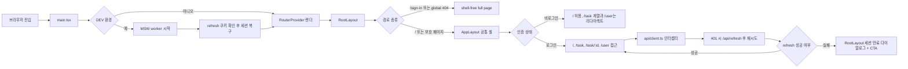

# KB Health FE 과제전형 제출 문서

## 1. 개요

이 저장소는 KB Health 프론트엔드 과제전형 제출용 React SPA입니다.

앱은 Vite + React + TypeScript 기반으로 구성했고, 개발 환경에서는 MSW가 브라우저에서 API를 가로채도록 설정해 별도 백엔드 없이 주요 사용자 흐름을 확인할 수 있습니다.

## 2. 요약

핵심 구현 상태는 아래와 같습니다.

- `/sign-in`과 global 404는 공통 레이아웃 밖의 full-page 화면입니다.
- 인증 만료와 권한 확인 실패는 즉시 redirect하지 않고, 전역 다이얼로그를 먼저 띄운 뒤 CTA로 `/sign-in` 이동을 유도합니다.
- 로그인 폼은 `mode: 'onChange'` 기준으로 입력 중 유효성 검사를 반영합니다.
- 대시보드 통계 카드는 로그인 상태에서만 `/task`로 이동 가능합니다.
- 할 일 목록은 badge-only로 상태 표시만 담당하고, 상태 변경은 상세 화면이 책임집니다.

## 3. 기술 스택

- React 18: 컴포넌트 기반 UI 라이브러리
- TypeScript: 정적 타입 지원 언어
- Vite: 빠른 개발 서버 및 빌드 도구
- TanStack Router v1: 타입 안전 라우팅, 보호 라우트 구성
- TanStack Query v5: 서버 상태 조회, 캐싱, 무한 스크롤 데이터 관리
- Zustand: 인증 상태 관리
- Axios: API 클라이언트, 인터셉터 기반 토큰 처리
- React Hook Form + Zod: 로그인 폼 상태 관리 및 검증
- Tailwind CSS v4: 유틸리티 기반 스타일링
- MSW: 브라우저 API mocking
- Lucide React: 페이지 및 내비게이션 아이콘

## 4. 주요 기능

- 로그인 폼의 onChange 유효성 검사와 실패 시 에러 모달 표시
- 인증 상태에 따른 보호 라우팅과 세션 복구
- 세션 만료 시 전역 다이얼로그 기반 재로그인 안내
- 대시보드 통계 조회와 로그인 상태 전용 빠른 이동 카드
- 할 일 목록 카드 렌더링, badge-style 상태 표시
- 가상 스크롤과 무한 스크롤 기반 목록 탐색
- 할 일 상세 조회, 상태 변경, shell 내부 404 빈 상태 처리
- 삭제 확인 모달에서 ID 일치 입력 후 삭제 수행
- 회원정보 조회

## 5. 폴더 구조

주요 디렉터리만 정리했습니다.
폴더 구조는 우선 역할 기반 구조를 원칙으로 설계하며, 시스템 규모와 복잡도가 증가할 경우 도메인 기반 구조로 점진적으로 확장할 수 있습니다.

```text
src/
├── api/         # axios 인스턴스, API 호출 함수
├── components/  # 공통 컴포넌트와 UI 컴포넌트
├── hooks/       # React Query 기반 데이터 조회 훅
├── layouts/     # RootLayout, AppLayout
├── mocks/       # MSW 브라우저 워커, API 핸들러
├── pages/       # SignIn, Dashboard, TaskList, TaskDetail, User 페이지
├── routes/      # TanStack Router 라우트 정의 및 인증 가드
├── store/       # Zustand 인증/상태 스토어
├── styles/      # 전역 스타일, 폰트, 색상 토큰
└── types/       # API 응답 타입
```

## 6. 아키텍처 / 설계 방향

이 프로젝트는 Vite 기반 React SPA입니다.

- 라우팅은 TanStack Router로 구성했고, `/`는 public 대시보드로 유지한 채 `/task`, `/task/:id`, `/user`만 보호 라우트로 분리
- 실제 인증 가드는 `src/routes/index.tsx`의 `beforeLoad`에서 처리
  <br/>
- 현재 구조에서는 공통 앱 셸(`AppLayout`)을 `/`, `/task`, `/task/:id`, `/user`에만 적용
- `/sign-in`과 global 404는 `RootLayout` 직속의 full-page 화면으로 분리
  따라서 로그인 화면과 전역 404에서는 GNB/LNB가 렌더링되지 않습니다.
  <br/>
- 서버 상태는 React Query로 관리
- 대시보드, 회원정보, 할 일 상세 조회는 일반 query로 처리
- 할 일 목록은 infinite query로 페이지 단위 데이터를 가져옴
- 목록 렌더링은 `src/pages/TaskListPage.tsx`에서 TanStack Virtual을 사용해 화면에 필요한 카드만 그리도록 구성
  <br/>
- 인증 상태 및 클라이언트 상태는 Zustand 스토어가 담당
- `src/store/authStore.ts`에서 access token은 메모리 상태로만 보관
- refresh token은 쿠키로만 사용
- `src/api/client.ts`의 Axios 인터셉터는 요청 시 Bearer 토큰을 주입
- 401 응답이 오면 `/api/refresh`를 통해 access token을 재발급받은 뒤 요청을 재시도
- 재발급이 실패하면 즉시 라우트를 바꾸지 않고 `RootLayout`의 전역 세션 만료 다이얼로그를 열어, 사용자가 CTA로 `/sign-in`으로 이동하도록 처리
  <br/>
- API는 개발 환경에서 MSW로 모킹
- `src/main.tsx`에서 DEV 환경일 때만 `src/mocks/browser.ts`의 워커를 시작
- 같은 파일에서 refresh 쿠키가 있으면 세션 복구도 수행
  <br/>
- 스타일은 Tailwind CSS v4를 사용
- `src/styles/globals.css`에 정의한 색상 토큰과 Pretendard 폰트를 공통 기준으로 사용

## 7. API 명세 요약

`documents/openapi.yaml` 기준으로 현재 프런트엔드가 사용하는 API를 요약했습니다.

| 메서드 | 경로               | 인증               | 요청/파라미터               | 성공 응답                                     | 주요 실패 응답              |
| ------ | ------------------ | ------------------ | --------------------------- | --------------------------------------------- | --------------------------- |
| POST   | `/api/sign-in`     | 없음               | body: `email`, `password`   | `accessToken`, `refreshToken`                 | `400` `errorMessage`        |
| POST   | `/api/refresh`     | refresh token 쿠키 | 없음                        | `accessToken`, `refreshToken`                 | `400`, `401` `errorMessage` |
| GET    | `/api/dashboard`   | Bearer token       | 없음                        | `numOfTask`, `numOfRestTask`, `numOfDoneTask` | `401` `errorMessage`        |
| GET    | `/api/task?page=N` | Bearer token       | query: `page`(정수, 1 이상) | `data[]`, `hasNext`                           | `401` `errorMessage`        |
| GET    | `/api/task/:id`    | Bearer token       | path: `id`                  | `title`, `memo`, `registerDatetime`           | `401`, `404` `errorMessage` |
| DELETE | `/api/task/:id`    | Bearer token       | path: `id`                  | `success: true`                               | `401`, `404` `errorMessage` |
| GET    | `/api/user`        | Bearer token       | 없음                        | `name`, `memo`                                | `401` `errorMessage`        |

## 8. 요구사항 반영 항목

| 요구사항          | 현재 구현                                                                                                                                                                                          |
| ----------------- | -------------------------------------------------------------------------------------------------------------------------------------------------------------------------------------------------- |
| 로그인 `/sign-in` | 이메일/비밀번호 label 제공, Zod 검증, `mode: 'onChange'` 기반 실시간 유효성 표시, 조건 충족 시 제출 활성화, 실패 시 API `errorMessage` 모달 표시                                                   |
| 대시보드 `/`      | 로그인 상태에서 `numOfTask`, `numOfRestTask`, `numOfDoneTask` 표시. 비로그인 상태에서는 live count 대신 잠금 UI와 로그인 유도 메시지를 보여주며, 통계 카드는 로그인 상태에서만 `/task`로 이동 가능 |
| 목록 `/task`      | `/api/task` 결과를 카드 목록으로 표시하고, 각 카드에 title, memo, badge-style status를 노출                                                                                                        |
| 가상 스크롤       | `TaskListPage.tsx`에서 TanStack Virtual 사용                                                                                                                                                       |
| 무한 스크롤       | `useInfiniteTasks.ts`의 infinite query와 `hasNext` 기반 다음 페이지 호출                                                                                                                           |
| 상세 `/task/:id`  | 상세 데이터 표시, 404 시 shell 내부 빈 상태와 목록 이동 버튼 제공, 상태 변경은 상세 화면에서만 수행                                                                                                |
| 삭제 기능         | 삭제 모달에서 현재 ID와 같은 값을 입력해야 확인 버튼 활성화, 삭제 후 목록 복귀                                                                                                                     |
| 회원정보 `/user`  | `/api/user` 결과의 이름과 메모 표시                                                                                                                                                                |
| 라우트 맵         | 대시보드, 할 일, 회원정보 내비게이션 제공. `/sign-in`과 global 404는 shell-free full-page 화면으로 분리                                                                                            |
| Mock API          | `src/mocks/handlers.ts` 기반 MSW 브라우저 목 서버 구성, 현실적인 더미 데이터 사용, OpenAPI 응답 shape 유지                                                                                         |

## 9. 요구사항 감사 결과

| 항목                              | 결과    | 현재 구현                                                                   | 원 요구사항과의 차이                                                                  |
| --------------------------------- | ------- | --------------------------------------------------------------------------- | ------------------------------------------------------------------------------------- |
| shell / 라우팅 구조               | PASS    | `/sign-in`과 global 404는 full-page, 나머지 업무 화면은 `AppLayout` 셸 사용 | 없음                                                                                  |
| 로그인 검증 / 오류 처리           | PASS    | `mode: 'onChange'` 실시간 검증, 실패 시 API `errorMessage` 모달 표시        | 없음                                                                                  |
| 401 / 세션 만료 UX                | PASS    | refresh 실패 시 전역 다이얼로그를 먼저 띄우고 CTA로 로그인 이동             | 없음                                                                                  |
| 대시보드 `/` 로그인 사용자 경험   | PASS    | 로그인 상태에서는 실제 통계 조회와 카드 클릭 이동 제공                      | 없음                                                                                  |
| 대시보드 `/` 비로그인 사용자 경험 | PARTIAL | 비로그인 상태에서는 lock UI와 로그인 CTA만 표시                             | 원 요구사항 표는 `/`에서 count 표기, 추가 설계로 guest에게 live count를 보여주지 않음 |
| 목록 `/task`                      | PASS    | 카드 목록, 가상 스크롤, 무한 스크롤, 카드 클릭 이동 구현                    | 없음                                                                                  |
| 상태 표현 / 변경 책임 분리        | PASS    | 목록은 badge-only status, 상태 변경은 상세 화면 전용                        | 없음                                                                                  |
| 상세 `/task/:id` 404              | PASS    | 404 시 목록 복귀 버튼이 있는 빈 상태 제공                                   | 없음                                                                                  |
| 회원정보 `/user`                  | PASS    | 이름과 메모 표시                                                            | 없음                                                                                  |

## 10. 구조 / 흐름 다이어그램



## 11. 제약사항 및 구현 원칙

- accessToken은 `localStorage`, `sessionStorage`에 저장하지 않습니다. 메모리 상태로만 관리합니다.
- refresh token은 쿠키로만 다룹니다.
- 색상은 `src/styles/globals.css`의 토큰을 기준으로 사용합니다.
- API는 개발 환경에서 MSW 기반 목 서버로 동작합니다.
- 인증이 필요한 페이지는 TanStack Router의 보호 라우트로 접근을 제한합니다.
- 할 일 목록은 가상 스크롤과 무한 스크롤을 함께 적용해 긴 목록에서도 DOM 렌더링 수를 제한합니다.

## 12. 실행 방법

### 설치

```bash
pnpm install
```

### 개발 서버 실행

```bash
pnpm run dev
```

- 기본 주소: `http://localhost:3000`
- 개발 모드에서만 MSW가 자동으로 시작됩니다.
- 테스트 계정
  - 이메일: `test@example.com`
  - 비밀번호: `Password1`

### 프로덕션 빌드

```bash
pnpm run build
```

- TypeScript 빌드와 Vite 번들을 함께 수행합니다.

### 정적 결과 미리보기

```bash
pnpm run preview
```

- 빌드 결과 확인용 명령입니다.
- 현재 MSW 초기화는 DEV 환경에서만 동작하므로, 주요 기능 흐름 확인은 `pnpm run dev` 기준으로 보는 것이 맞습니다.

### 코드 점검

```bash
pnpm run lint
```

## 13. 작동 설명 / 페이지 동선

1. 로그인
   - `/sign-in`은 공통 GNB/LNB 없이 독립적인 full-page 화면으로 렌더링됩니다.
   - 이메일과 비밀번호를 입력하면 유효성 검사가 입력 중 바로 반영됩니다.
   - 유효성 검사를 통과하면 로그인 버튼이 활성화됩니다.
   - 로그인 성공 시 access token을 상태에 저장하고 대시보드로 이동합니다.
   - 로그인 실패 시 API의 `errorMessage`를 모달로 표시합니다.

2. 대시보드
   - 로그인 상태에서는 `/`에서 전체 할 일, 해야할 일, 완료한 일 통계를 확인합니다.
   - 비로그인 상태에서는 live count 대신 잠금 UI와 로그인 CTA를 보여주고, 통계 카드는 클릭되지 않습니다.
   - 로그인 상태에서는 각 통계 카드를 눌러 `/task`로 바로 이동할 수 있습니다.
   - 상단 GNB와 좌측 또는 하단 LNB를 통해 다른 화면으로 이동할 수 있습니다.

3. 할 일 목록
   - `/task`에서 카드 목록을 확인합니다.
   - 각 카드는 title, memo, badge-style status를 함께 보여줍니다.
   - 스크롤 영역 안에서 필요한 카드만 렌더링합니다.
   - 목록 끝에 도달하면 다음 페이지를 자동으로 불러옵니다.

4. 할 일 상세 및 삭제
   - 목록 카드 클릭 시 `/task/:id`로 이동합니다.
   - 제목, 메모, 등록 일시를 확인할 수 있습니다.
   - 상태 변경은 목록이 아니라 상세 화면에서만 수행합니다.
   - 삭제 버튼을 누르면 확인 모달이 열리고, 현재 할 일 ID를 정확히 입력했을 때만 삭제를 진행할 수 있습니다.
   - 삭제가 완료되면 목록으로 돌아갑니다.
   - 존재하지 않는 ID는 단순화된 빈 상태 화면과 함께 목록 복귀 버튼을 제공합니다.

5. 회원정보 / 전역 예외 처리
   - `/user`에서 로그인한 사용자 이름과 메모를 확인합니다.
   - global 404는 공통 셸 없이 full-page 화면으로 렌더링되고, 대시보드 복귀 버튼을 제공합니다.

---

## 14. 개발 환경과 프로덕션 환경의 차이

> 이 프로젝트는 과제전형용 제출물로, 실제 백엔드 없이 동작 확인이 가능하도록 일부 기능을 개발 환경 전용으로 구성했습니다.
> 아래 항목들은 실제 프로덕션 배포 시 별도로 처리되어야 하는 부분입니다.

### 🔌 Mock API (MSW)

개발 환경에서는 [MSW(Mock Service Worker)](https://mswjs.io/)가 브라우저 단에서 API 요청을 가로채 응답을 반환합니다.

- `src/main.tsx`에서 `import.meta.env.DEV`일 때만 MSW 워커를 시작합니다. 프로덕션 빌드에서는 워커가 초기화되지 않고, 실제 백엔드 엔드포인트로 요청이 전달됩니다.
- 모든 Mock 핸들러는 `src/mocks/handlers.ts`에 정의되어 있습니다.

| 항목 | 개발 환경 (현재) | 프로덕션 |
|------|-----------------|---------|
| 인증 계정 | `test@example.com` / `Password1` 고정 | 실제 사용자 DB 인증 |
| 발급 토큰 | `mock.access.token` 등 고정 문자열 | 서버에서 서명된 JWT |
| Task 데이터 | 55개 절차적 생성 더미 데이터 | 실제 DB 조회 결과 |
| PATCH / DELETE | 결과를 메모리에만 반영 | DB에 즉시 영속 저장 |

### 🔄 새로고침 시 데이터 초기화

개발 환경에서 Task의 상태 변경(TODO ↔ DONE)과 삭제는 **페이지를 새로고침하면 원래대로 돌아옵니다.**

이는 MSW 핸들러가 변경 사항을 브라우저 메모리(`statusOverrides` Map, `deletedTaskIds` Set)에만 저장하기 때문입니다. 같은 세션 내에서는 목록·상세·대시보드가 일관된 값을 보여주지만, 새로고침 시 초기 목 데이터로 복원됩니다.

프로덕션에서는 모든 변경이 서버 DB에 영속적으로 저장됩니다.

### 📦 목 데이터 구성

`src/mocks/handlers.ts`의 더미 Task 데이터는 아래 규칙으로 생성됩니다.

- 총 55개 (6페이지, 마지막 페이지는 5개)
- 3의 배수 인덱스는 `DONE`, 나머지는 `TODO`
- 등록 일시 기준값: `2026-04-09 08:30 UTC`

### 🔑 세션 복구 흐름

access token은 메모리에만 보관하고 refresh token은 쿠키에 저장합니다. 새로고침 시 쿠키의 refresh token으로 `/api/refresh`를 호출해 access token을 복구합니다.

개발 환경에서는 MSW가 `/api/refresh` 요청을 가로채 mock refresh token을 검증합니다. 프로덕션에서는 동일한 흐름으로 실제 인증 서버에 요청합니다.

### 🛠 개발 전용 UI

TanStack Router Devtools(`<TanStackRouterDevtools />`)는 `import.meta.env.DEV`일 때만 화면 우측 하단에 노출됩니다. 프로덕션 빌드에서는 렌더링되지 않습니다.

### ⚙️ API 엔드포인트 설정

현재 API 경로는 `/api/*`로 하드코딩되어 있으며, 별도의 `.env` 파일이나 `VITE_API_BASE_URL` 환경 변수를 사용하지 않습니다. 실제 프로덕션 배포 시에는 환경 변수로 API Base URL을 주입하는 설정이 필요합니다.
